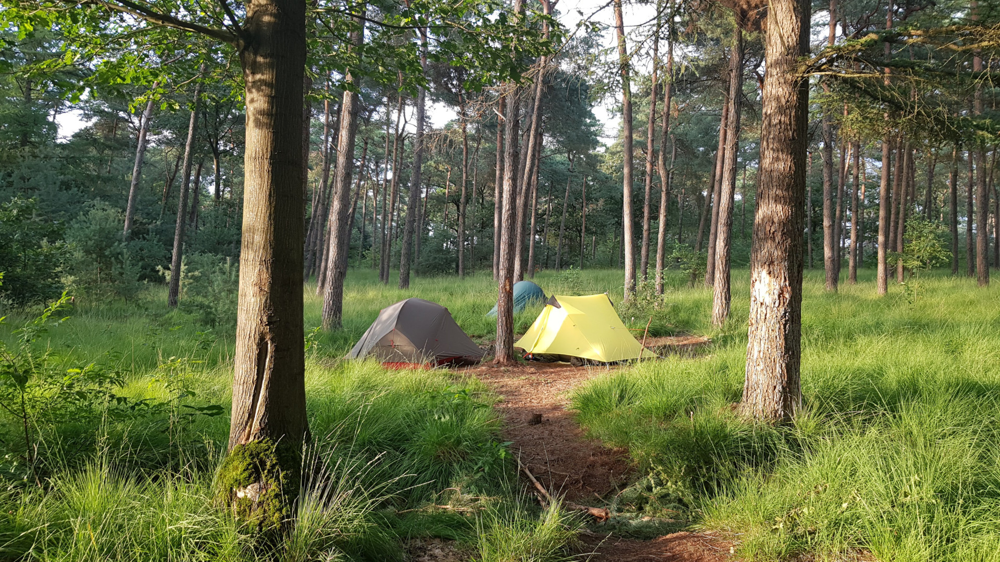

# PaalDB

_A smart database of paalkampeer locations_

This is a pretty niche project. Paalkamperen is a concept not many people will
be familiar with. So it deserves some extra explanation.

In the Netherlands it is illegal to camp in nature ("wild camping"), except at
specified locations. Those locations are marked by a sign on a pole, hence the
name pole camping or paalkamperen. Belgium has a similar concept, known as
'bivak zones' or 'aires de bivouac', where you are also allowed to camp for a
limited duration.


While very different from a legal perspective, Denmark has an excellent app to
find shelters ([Android](https://play.google.com/store/apps/details?id=dk.shelter.app)
and [iOS](https://apps.apple.com/dk/app/shelter/id626652345)). And while on
holiday in Sweden, we found an awesome [Google map](https://www.google.com/maps/d/u/0/viewer?mid=1doLXXvokOtiMzthVz0SLFjEPmD4&ll=63.4103055477356%2C15.615789630029894&z=5)
with all shelters there.

## So why make this?

For two main reasons.

First, the Danish app made me kind of jealous. Information on these locations in
the Netherlands is scattered and often outdated. There are many different
competing sources available, but it seems like no single source manages to be
both complete and up to date. It seems to me like we Dutchies need to stop
competing and start working on a collaborative model where we can use the power
of the masses.

Second, paalkampeer locations (at least those from Staatsbosbeheer) seem to be
under threat. Too many people leaving too much trash, having parties, just being
annoying. And so Staatsbosbeheer is (understandably) closing more of these
locations than they are opening. Our hope is that maybe, with more information,
we can battle this issue. If we can better inform the public, communicate
differently, maybe even gather some relevant statistics for Staatsbosbeheer, we
may be able to turn the tide. An app just might be able to do that.

Because it would be a real shame if we have to leave our country to find places
like this:



But making an app to "save the poles" is a big project. Too big for a couple of
friends to pull off. So let's take baby steps. Knowing what we're dealing with,
and where the poles are, seems like a good first step.

So the idea of PaalDB was born, as an attempt to automatically gather and
merge information from various sources about paalkampeer locations in the
Netherlands<sup>[1](#footnote-1)</sup>. It would be nice to get one
authoritative source of information that other apps and websites can both
contribute to and build on. Preferably one that's open and free and has a clear
API.

<a name="footnote-1"><sup>1</sup></a>) And while I'm at it, there's no reason
not to include sources for other countries too. It doesn't really make a
difference from a technical standpoint.

## Sources

Apart from the foreign sources I already mentioned, I found these sources for
information on paalkampeer locations:

* [x] [Staatsbosbeheer](https://www.logerenbijdeboswachter.nl/paalkamperen)
* [x] [Stefan Kruithof's map](https://sites.google.com/site/paalkampeerders/kaart)
* [x] [Kampeermeneer](https://www.kampeermeneer.nl/paalkamperen/)
* [x] [Rugzaklopers](http://www.communitywalk.com/14583)
* [x] [Wild-kamperen.nl](https://www.wild-kamperen.nl/paalkamperen-wildkamperen/)
* [ ] [Hiking-site.nl](https://www.hiking-site.nl/routes_paalkamperen.php)
* [ ] [Natuur en Bos](https://www.natuurenbos.be/kamperen) (Belgium)
* [ ] [Bivakzone.be](http://www.bivakzone.be/) (Belgium)
* And [various threads](http://forum.bushcraftnederland.nl/viewtopic.php?t=14504) with people [sharing other](https://www.wereldfietser.nl/phpbb/viewtopic.php?t=31030) random maps

_Checked means locations can be automatically imported_

If you know of other sources, or if you're interested in helping to write an
importer for one of these sources (maybe you own the website..?) please get in
touch with me through [mail@timendus.com](mailto:mail@timendus.com).

## Status of the software

This software can currently import locations from several sources. It then tries
to merge the information as best as it can into a single table with locations.
The next step is to add an API on top of that so that other projects can build
on top of this one.

Another thing to do is to add more importers. This shouldn't be too hard. The
importers I've written so far are for a KML file and to parse a static website.
If a new source matches one of those two means of import, writing a new importer
should be mostly copy'n'paste.

## Getting it up and running

```bash
# Get the repo
git clone git@github.com:Timendus/paaldb.git
cd paaldb

# Configure your database credentials
cp config/config_example.json config/config.json
vim config/config.json

# Install dependencies
npm install

# Initialize the database
npx sequelize db:create
npx sequelize db:migrate

# Start the server
npm start
```
