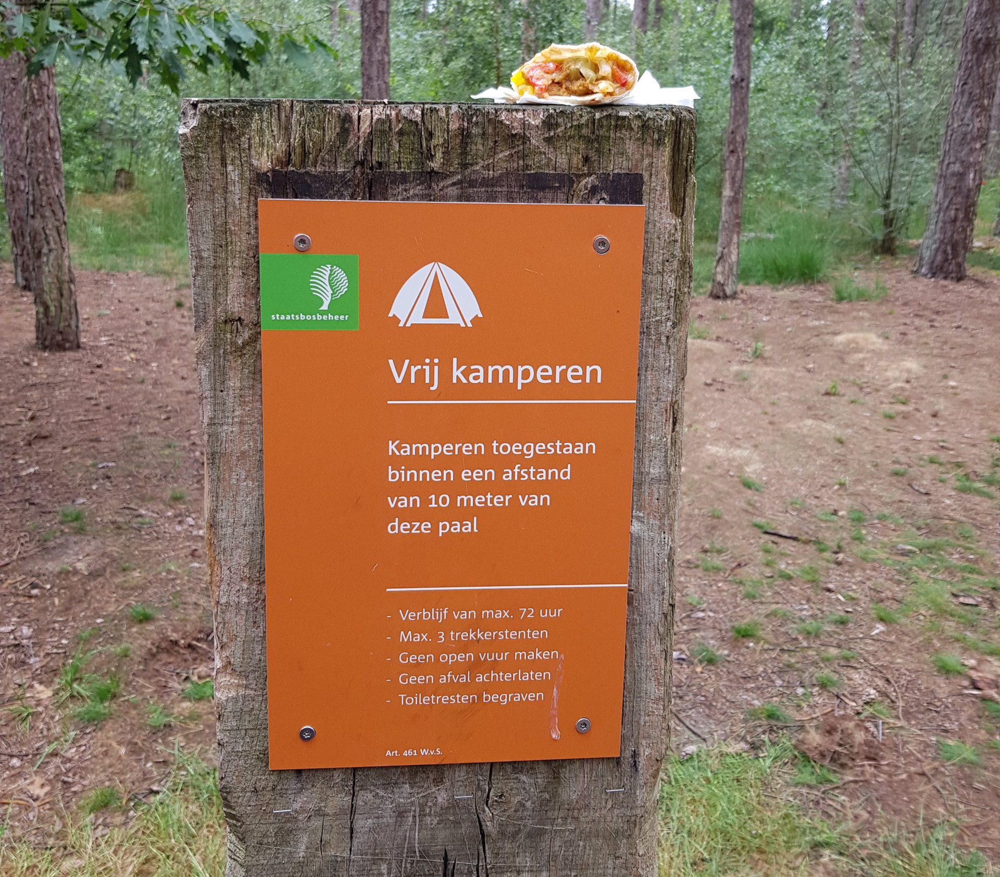

# PaalDB

_A smart database of paalkampeer[1](#what-is-it) locations_

See [this project's wiki](https://github.com/Timendus/paaldb/wiki) for more
information about PaalDB.

<a name="what-is-it">1</a>) In the Netherlands it is illegal to camp
in nature ("wild camping"), except at specified locations. Those locations are
marked by a sign on a pole, hence the name pole camping or paalkamperen. Belgium
has a similar concept, known as 'bivak zones' or 'aires de bivouac', where you
are also allowed to camp for a limited duration.

See [this project's wiki](https://github.com/Timendus/paaldb/wiki) for more
information about PaalDB.
